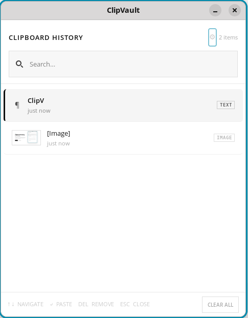

# 📋 ClipVault

**Windows-style clipboard history for Linux — press Win+V, pick, paste.**

[](LICENSE)
[](https://github.com/Oblivion97/clipvault/releases)
[]()
[]()

ClipVault runs silently in the background and remembers everything you copy.
Press **Win+V** to open a searchable popup, navigate with arrow keys, and press
Enter to paste — just like Windows 11 clipboard history.

🌐 **[clipvault website](https://oblivion97.github.io/clipvault)**



---

## Features

| | |
|---|---|
| **Win+V shortcut** | Opens history popup from anywhere |
| **200-item history** | Persists across reboots |
| **All content types** | Text, links, code snippets, images |
| **Image previews** | Live thumbnails for copied images |
| **Instant search** | Filter history by typing |
| **Keyboard navigation** | ↑↓ arrows, Enter to paste, Del to remove |
| **System tray icon** | Pause, clear, or open settings from the tray |
| **Settings page** | Configure history limit, paste speed, privacy, and more |
| **Wayland + X11** | Works on all modern Linux desktops |
| **Cross-distro** | Ubuntu, Fedora, Arch, Pop!\_OS, Mint, openSUSE |
| **Auto-starts** | Runs silently at every login |

---

## Install

### Debian / Ubuntu / Mint / Pop!_OS / Zorin / elementary OS

```bash
sudo dpkg -i clipvault_1.2.0_all.deb
sudo apt-get install -f
```

### Fedora

```bash
sudo dnf install clipvault-1.2.0.noarch.rpm
```

### openSUSE

```bash
sudo zypper install clipvault-1.2.0.noarch.rpm
```

### Arch / Manjaro / Any distro — Universal installer

```bash
wget https://github.com/Oblivion97/clipvault/releases/latest/download/clipvault-1.6.0.zip
unzip clipvault-1.6.0.zip && cd clipvault-1.2.0
chmod +x install.sh && ./install.sh
```

Download the latest packages from [GitHub Releases](https://github.com/Oblivion97/clipvault/releases/latest).

The installer automatically:
- Detects your distro and installs all dependencies (apt / dnf / pacman / zypper)
- Registers the **Win+V** keyboard shortcut in your DE
- Sets up autostart on login
- Starts ClipVault immediately

---

## Usage

1. Copy anything with **Ctrl+C** — ClipVault records it silently
2. Press **Win+V** anywhere to open history
3. Use **↑↓** to navigate, **Enter** to paste, **Esc** to close
4. Or just **click** any item to paste it directly
5. **Type** while the popup is open to search and filter

### Keyboard shortcuts

| Key | Action |
|---|---|
| ↑ / ↓ | Navigate items |
| Enter | Paste selected item |
| Delete | Remove item from history |
| Esc | Close without pasting |
| Type anything | Search and filter |

---

## Distro compatibility

| Distro | Installer |
|---|---|
| Ubuntu 20.04 – 24.04 | ✅ `.deb` |
| Pop!\_OS | ✅ `.deb` |
| Linux Mint | ✅ `.deb` |
| Debian 11+ | ✅ `.deb` |
| Zorin OS | ✅ `.deb` |
| elementary OS | ✅ `.deb` |
| Fedora 38+ | ✅ `.rpm` |
| openSUSE Tumbleweed / Leap | ✅ `.rpm` |
| Arch / Manjaro / EndeavourOS | ✅ `.zip` |
| Any Linux with Python 3.8+ | ✅ `.zip` |

---

## Wayland notes

The installer handles everything automatically. Here is what it sets up:

**Clipboard monitoring** uses `wl-clipboard` — installed automatically.

**Auto-paste** uses `ydotool`. The installer enables its daemon via systemd.
Without it, items are still copied to clipboard — just press **Ctrl+V** yourself.

**Win+V shortcut** is registered automatically for GNOME, KDE, Cinnamon and MATE.
On other DEs add manually: Command `pkill -USR1 -f clipvault.py`, Key `Super+V`.

---

## Uninstall

```bash
chmod +x uninstall.sh && ./uninstall.sh
```

Or manually:

```bash
pkill -f clipvault.py 2>/dev/null
rm -rf ~/.local/share/clipvault ~/.config/clipvault
rm -f  ~/.config/autostart/clipvault.desktop
rm -f  ~/.local/share/applications/clipvault.desktop
```

---

## Requirements

- Linux
- Python 3.8+
- GTK 3 — installed automatically by the installer

---

## Community & Contributing

ClipVault is open source and contributions of any kind are welcome — bug fixes, new features, distro support, translations, or just feedback.

### Ways to contribute

- **Report a bug** — [Open an issue](https://github.com/Oblivion97/clipvault/issues) with steps to reproduce
- **Request a feature** — [Start a discussion](https://github.com/Oblivion97/clipvault/discussions) before building so we can align
- **Submit a fix** — Fork, branch, PR. Keep changes focused and describe the why
- **Improve docs** — Typos, clearer wording, missing distro coverage — all appreciated
- **Test on your distro** — Try it and report back if something breaks

### Getting started

```bash
git clone https://github.com/Oblivion97/clipvault
cd clipvault
python3 clipvault.py
```

### Guidelines

- Open an issue before starting large changes
- One feature or fix per pull request
- Update [CHANGELOG.md](CHANGELOG.md) for any user-facing changes
- Keep the installer cross-distro — test on at least one non-Ubuntu system if touching `install.sh`

### Good first issues

Look for issues tagged [`good first issue`](https://github.com/Oblivion97/clipvault/issues?q=label%3A%22good+first+issue%22) — small, well-scoped tasks ideal for first-time contributors.

All contributors are welcome regardless of experience level.

---

## Publishing a release

```bash
./release.sh 1.3.0
```

This will bump the version, build `.deb`, `.rpm`, and `.zip` packages, commit, tag, push, and upload all assets to a GitHub release automatically.

Requires `gh` CLI to be installed and authenticated: `sudo apt install gh && gh auth login`

---

## License

[MIT](LICENSE)
